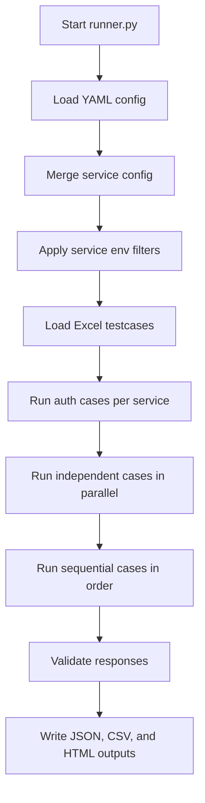

# Architecture

## Components

| Component | Responsibility |
| --- | --- |
| `runner.py` | Orchestrates loading, execution, flow handling, validation, and report writing |
| `utils/api_client.py` | Sends HTTP requests with timeout and retry support |
| `utils/template_engine.py` | Replaces `${TOKEN}` placeholders inside JSON templates |
| `utils/data_generator.py` | Generates runtime values such as RRN, STAN, date, and time |
| `utils/service_manager.py` | Stores merged per-service configuration and applies service filters |
| `utils/logger.py` | Configures rotating file and console loggers |
| `validators/response_validator.py` | Validates status codes, JSON fields, and response text/body content |
| `slack_report_alert.py` | Watches generated HTML reports and posts summary notifications to Slack |
| `scripts/` | Helper utilities for creating or inspecting testcase Excel files |

## Runner Lifecycle

## Execution Ordering

For each enabled service:

1. Auth APIs are detected from `auth.apis` in the service config and run first.
2. Non-auth testcases with numeric IDs below 11 are treated as independent and run in parallel.
3. Non-auth testcases with numeric IDs 11 or higher are treated as sequential and run in numeric order.

This behavior is controlled by `SITRunner._is_sequential_testcase()`.

## Service Resolution

When loading each Excel row, the runner resolves the service in this order:

1. Explicit `Service` column, if present.
2. Request file naming hints such as `acq`, `merchant`, or `merchant_cas`.
3. API name if it appears in exactly one configured service.
4. Workbook default service.

## Authentication And Token Routing

Each service can define:

- `auth.apis`: API names that are considered authentication calls.
- `auth.token_json_path`: JSON path used to extract the token from the auth response.
- `token_routing`: API-to-channel mapping used to decide which bearer token should be attached.

When an auth testcase runs successfully and the token is found, the runner stores it in a service-specific token context. Later API calls receive an `Authorization: Bearer <token>` header when a matching token exists.

## Flow Support

The runner supports two flow styles under `config/apis.yaml`.

Polling flow:

- Send an initial API request.
- Extract a correlation value from the initial response.
- Poll another API until a configured stop condition is met or timeout is reached.

Chained success flow:

- Send an initial API request.
- If `response_code` is `00`, map fields from the initial response into tokens.
- Render and send the next request.
- If the initial response is not successful, validate the initial response and skip the next request.

